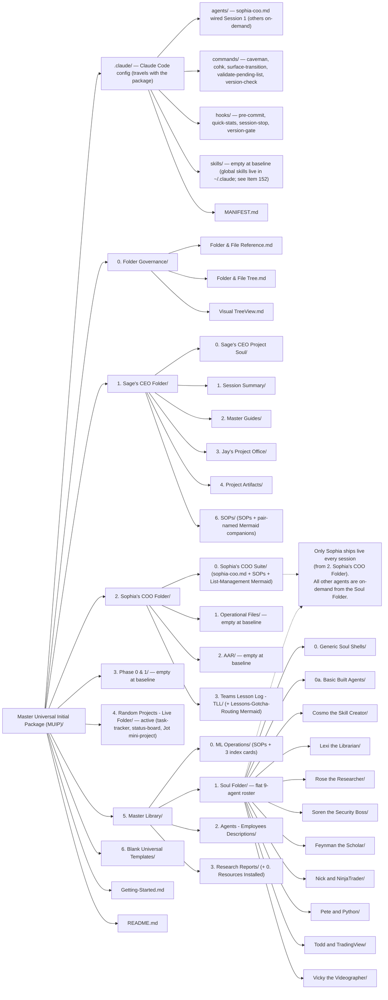

# Visual TreeView — Master Universal Initial Package (MUIP)

**Status:** Living Document — ACTIVE PROJECT INSTANCE (Random Projects). Updates with Folder & File Reference and Folder & File Tree (Item 141).
**Last Updated:** 2026-07-06 — Session 1 activation reflect (Live Folder renamed to Random Projects + Jot subfolder; Sophia wired to `.claude/agents/`).
**Owner:** Sophia (COO)

---

> This is the at-a-glance structural map of the Master Universal Initial Package (MUIP) in its final (post-restructure) starting state.
> Every new project begins here. Phase 0 activates and fills the structure.
> Read `Getting-Started.md` (version root) for the activation sequence.
> Read `Folder & File Tree.md` for the exhaustive file-by-file listing; this view is the graphical orientation map.
> Paste the diagram block below into [mermaid.live](https://mermaid.live) to view it visually.

> **Final structure note (Session 265 end-pass):** Top-level folders 0–6. Retired: Standing Agents, Special Project Agents, Shared Agent Resources (Shared/Cross-Agent is now an on-demand subfolder of the Live Folder). All 9 agents flat in `5. Master Library/1. Soul Folder/`. WorkTree → Live Folder. Mermaid companions pair-named. Only Sophia ships live; every other agent is on-demand from the Soul Folder.

---

---

## Quick orientation table

| Folder | What's there at baseline | Phase 0 action |
|--------|--------------------------|----------------|
| `.claude/` | Claude Code config that travels with the package: `agents/`, `commands/` (5), `hooks/` (4), empty `skills/`, MANIFEST.md | Sophia wired into `agents/`; global-vs-travels split resolved at Item 152 (P8) |
| `0. Folder Governance/` | 3 governance docs (Reference, Tree, TreeView) + README | None — reference only |
| `1. Sage's CEO Folder/` | Master Guides, SOPs (+ pair-named Mermaids), soul/session/artifacts subfolders | Soul + session records filled |
| `2. Sophia's COO Folder/` | COO Suite (sophia-coo.md, SOPs, List-Management Mermaid), TLL, operational/AAR shells | Operational files deployed; Sophia wired to `.claude/agents/` |
| `3. Phase 0 & 1/` | README only — empty at baseline | Populated as Phase 0/1 produce records |
| `4. Random Projects - Live Folder/` | Active — task-tracker, status-board, and the Jot mini-project subfolder | Renamed at Session 1; active work lands here |
| `5. Master Library/` | ML Operations, flat 9-agent Soul Folder, agent descriptions, Research Reports | On-demand agent pulls; resources cataloged |
| `6. Blank Universal Templates/` | 24 blank templates + README | Templates pulled and deployed |

---

*Regenerated from disk Session 265 (P7 end-pass). At-a-glance map of folders 0–6 with the flat 9-agent Soul Folder and retired folders removed. For the exhaustive file listing, see `Folder & File Tree.md`; for purpose/decision context, see `Folder & File Reference.md`.*
