```mermaid
%%{init: {'theme': 'dark', 'themeVariables': {'primaryColor': '#1E3A5F', 'primaryTextColor': '#ffffff', 'primaryBorderColor': '#4A9EFF', 'lineColor': '#7EB8D4', 'secondaryColor': '#1A2744', 'tertiaryColor': '#1A2744'}}}%%
flowchart TD
    classDef startEnd fill:#00695C,stroke:#004D40,color:#ffffff
    classDef process fill:#1565C0,stroke:#0D47A1,color:#ffffff
    classDef decision fill:#E65100,stroke:#BF360C,color:#ffffff
    classDef gate fill:#7B1FA2,stroke:#4A148C,color:#ffffff

    START([New Agent Identified]):::startEnd
    START --> ST1_A

    subgraph ST1["  STAGE 1 — Generic Soul Shell  "]
        ST1_A["Sage creates generic shell\nRole, Objective, Identity, Tone\nPrinciples, Outputs, Capabilities"]:::process
        ST1_B[Shell filed in: 0. Generic Soul Shells]:::process
        ST1_A --> ST1_B
    end

    ST1_B --> ST2_A

    subgraph ST2["  STAGE 2 — True Soul Build  "]
        ST2_A[Pull generic shell]:::process
        ST2_B[Read Soul Governance Template]:::process
        ST2_C[Build the true soul]:::process
        ST2_D[Soul Gap Check — document undocumented behaviors]:::process
        ST2_E{Soul complete?}:::decision
        ST2_A --> ST2_B --> ST2_C --> ST2_D --> ST2_E
        ST2_E -->|NO — fill gaps| ST2_C
    end

    ST2_E -->|YES| FILED2[Soul filed in: 0a. Basic Built Agents]:::process
    FILED2 --> NEEDQ{Agent needed on live project NOW?}:::decision
    NEEDQ -->|NO| WAIT([Soul stays in 0a until needed]):::startEnd

    NEEDQ -->|YES| ST3_0

    subgraph ST3["  STAGE 3 — Basic SOP Build — DEPLOYMENT GATE  "]
        ST3_0["Step 0: Paired Version Decision\nBidirectional — flag unnecessary Yes\nmake case for warranted No"]:::process
        ST3_A[Step 0a: Pointer Scan — search all SOPs and MGs]:::process
        ST3_B[Step 0b: Read soul + soul gap check]:::process
        ST3_C[Step 0c: Compile input list]:::process
        ST3_D[Step 1: Inside-Out Draft — agent reviews — lock V1]:::process
        ST3_E[Step 2: Outside-In Pass — agent reviews — V2 final]:::process
        ST3_F[Backward Sweep — full — no shortcuts]:::process
        ST3_G[Team Lessons Check — ask every agent directly]:::process
        ST3_0 --> ST3_A --> ST3_B --> ST3_C --> ST3_D --> ST3_E --> ST3_F --> ST3_G
    end

    ST3_G --> DEPGATE["DEPLOYMENT GATE CLEARED\nAgent graduates to: Name's Folder — Basic SOP"]:::gate
    DEPGATE --> LIVE[Agent is LIVE on project\nJay reviews on-the-fly during use]:::process
    LIVE --> ST4_0

    subgraph ST4["  STAGE 4 — Full SOP Build — AAR GATE  "]
        ST4_0["Step 0: Paired Version Decision\nBidirectional — flag unnecessary Yes\nmake case for warranted No"]:::process
        ST4_A[Step 0a: Pointer Scan — expanded scope]:::process
        ST4_B[Step 0b: Read soul + soul gap check]:::process
        ST4_C[Step 0c: Compile input list including Jay's corrections]:::process
        ST4_D[Step 1: Inside-Out Draft — V1 locked]:::process
        ST4_E[Step 2: Outside-In Pass — V2 final]:::process
        ST4_F["Step 3: Jay's Version + Jay's Formal Review — last internal gate"]:::process
        ST4_G[Step 4: Backward Sweep — triggered by Jay's approval]:::process
        ST4_H[Step 5: Team Lessons Check]:::process
        ST4_0 --> ST4_A --> ST4_B --> ST4_C --> ST4_D --> ST4_E --> ST4_F --> ST4_G --> ST4_H
    end

    ST4_H --> AARGATE["AAR GATE CLEARED\nAgent graduates to: Name's Folder\nBasic SOP label removed"]:::gate
    AARGATE --> PROFCREATE["Sophia creates description profile\n5. Master Library / 2. Agents - Employees Descriptions\nFile: firstname-role-description.md\nAgent not graduated until profile exists"]:::process
    PROFCREATE --> DONE([Agent fully deployed]):::startEnd
```

=======================================================================
  MERMAID CODE
  Workflow: Generic Soul to Fully Deployed
  Version: v1.1 — 2026-06-01 (Stage 4: description profile creation step added as graduation final step — Session 199)
  How to use: Copy everything inside the code block below.
               Paste into mermaid.live. Export as PNG.
=======================================================================

