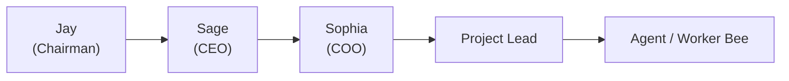

# Army vs. Company — Visual Workflow
**Draft v1 — Session 154**
*KISS method. First draft — Jay reviews and directs changes.*

---

## Term Translations

| Army Term | Company Equivalent |
|---|---|
| SOP | SOP · Pipeline · Workflow · Flowchart |
| Soldier | Agent or Employee |
| Military Occupational Specialty (MOS) | Job Title |
| MOS Duties | Role · Responsibilities · Rules · Boundaries |
| Officers | Make the big plans |
| NCOs (Non-Commissioned Officers) | Make sure the mission actually gets done correctly |

**NCOs are the backbone of the Army — and the backbone of this company.**

---

## Chain of Command — Army vs. Company

```mermaid
flowchart LR

    subgraph ARMY["ARMY STRUCTURE — Flexible · Scales with Project Complexity"]
        direction TB
        A1["Corps / Theater Army<br/>(General)"]
        A2["Division<br/>(Major General + CSM)"]
        A3["Brigade<br/>(Colonel + CSM)"]
        A4["Battalion<br/>(Lieutenant Colonel + CSM)"]
        A5["Company<br/>(Captain + First Sergeant)"]
        A6["Platoon<br/>(Lieutenant + Platoon Sergeant)"]
        A7["Squad<br/>(Staff Sergeant — Squad Leader)"]
        A8["Fire Team<br/>(Sergeant / Corporal — Team Leader)"]
        A9["Individual Soldier<br/>(SPC / PV2 / PVT)"]
        Af(["THE FLOOR<br/>Doctrine · Field Manuals · SOPs"])

        A1 --> A2 --> A3 --> A4 --> A5 --> A6 --> A7 --> A8 --> A9 --> Af
    end

    subgraph COMPANY["COMPANY / CORPORATE STRUCTURE"]
        direction TB
        C1["Holding Corp<br/>(Chairman — Jay)"]
        C2["Sub-Company / Subsidiary<br/>(CEO)"]
        C3["Department<br/>(COO / Department Head)"]
        C4["Division — Multiple Projects<br/>(Director / VP)"]
        C5["Project Team<br/>(Project Lead / PM)"]
        C6["Sub-Team<br/>(Team Lead / Senior Agent)"]
        C7["Agent / Employee<br/>(Worker Bees)"]
        Cf(["THE FLOOR<br/>Processes · SOPs · Workflows · Pipelines"])

        C1 --> C2 --> C3 --> C4 --> C5 --> C6 --> C7 --> Cf
    end

    A1 ~~~ C1
```

---

## Small Project Example — Current Team

---

## Notes

- **Army structure is flexible** — the level engaged depends on project complexity. A small project starts at Company/Platoon level. Large or multi-team projects scale up to Battalion, Brigade, or higher.
- **The floor never changes** — everything rests on processes, SOPs, and doctrine. The hierarchy serves the mission; the floor IS the mission.
- **Officers make the plan. NCOs make it happen.** This principle holds at every level, in every project.
- **Jay fills in Army-side blanks as needed** — levels can be marked TBD based on project complexity.
