```mermaid
%%{init: {'theme': 'dark', 'themeVariables': {'primaryColor': '#1E3A5F', 'primaryTextColor': '#ffffff', 'primaryBorderColor': '#4A9EFF', 'lineColor': '#7EB8D4', 'secondaryColor': '#1A2744', 'tertiaryColor': '#1A2744'}}}%%
flowchart TD
    classDef startEnd fill:#00695C,stroke:#004D40,color:#ffffff
    classDef process fill:#1565C0,stroke:#0D47A1,color:#ffffff
    classDef decision fill:#E65100,stroke:#BF360C,color:#ffffff

    START([COHK Triggered]):::startEnd
    SCOPE{Scope Check\nIsolated Minor Fix or Full COHK?\nStructural overhaul in scope? → pre-overhaul inventory fires — Item 141}:::decision
    START --> SCOPE
    SCOPE -->|Isolated Minor Fix| MFIX1[Apply fix directly]:::process
    MFIX1 --> MFIX2["Paired file check\nDoes fix affect any other file? If yes — apply those now"]:::process
    MFIX2 --> MFIX3[Verify fix is complete and correct]:::process
    MFIX3 --> MINOR([Done — minor fix complete. No COHK required.]):::startEnd
    SCOPE -->|Full COHK| SSSCHECK{SSS Split Required?}:::decision
    SSSCHECK -->|Yes — flag for Step 17| S1
    SSSCHECK -->|No| S1

    subgraph P1["  PHASE 1 — Cleanup and Jay Review  "]
        S1[Step 1: Sage's Opening Sweep]:::process
        S2[Step 2: LHF Formal Cleanup — run once]:::process
        S3[Step 3: Sophia Pending Changes Review]:::process
        S4["Step 4: Cross-Reference Sweep\nForward-only by design — Step 8 adds the backward sweep"]:::process
        S5["Step 5: Due Outs Collected — Steps 1 to 4\nLHF-soul gap check: did Step 2 LHF change alter scope?"]:::process
        S6["Step 6: Mini-AAR — Sophia's Pending AAR List\nItem by item. Minor: action now. Major: flag for Step 7."]:::process
        S7["Step 7: Jay's Review + Personal LHF\nCovers Step 5 due outs + Step 6 Mini-AAR items"]:::process
        D1{"Step 7a: New work found?"}:::decision
        S7b["Step 7b: [SAGE CALL] Phase 1 loop: clean\nNo new work generated. Phase 1 closed → Phase 2."]:::process
        S1 --> S2 --> S3 --> S4 --> S5 --> S6 --> S7 --> D1
        D1 -->|YES| S3
        D1 -->|NO| S7b
    end

    S7b --> S8

    subgraph P2["  PHASE 2 — Verification and Final Jay Review  "]
        S8["Step 8: Cross-Reference Sweep — 2nd pass\n→ FORWARD: confirm all references exist\n→ BACKWARD: confirm all existing references are accurate\n→ v0.1/BLANK SYNC (standing): confirm all changes since last COHK applied to both versions"]:::process
        S9[Step 9: Insanity Check]:::process
        S10[Step 10: Due Outs Collected — Steps 8 to 9]:::process
        S11[Step 11: Jay's Review]:::process
        D2{New work found?}:::decision
        S8 --> S9 --> S10 --> S11 --> D2
        D2 -->|YES| S8
    end

    D2 -->|NO| S12

    subgraph CS["  CLOSING SEQUENCE  "]
        S12["Step 12: Gate — Jay's All-Clear"]:::process
        S13[Step 13: Soul Sync]:::process
        S14[Step 14: project_context.md Review]:::process
        S15[Step 15: Final Wrap-Up Notes]:::process
        S16[Step 16: Jay's Personal Housekeeping — Jay confirms before proceeding]:::process
        S17["Step 17: Create New Files + Archive — SSS Split here\nCQC-02: No Session Summary archive subfolder pre-built\nNaming convention handles disambiguation"]:::process
        S18[Step 18: GitHub Verify + Push]:::process
        D3{Step 19: Continue or Done?}:::decision
        S20[Step 20: Branch Execution]:::process
        S12 --> S13 --> S14 --> S15 --> S16 --> S17 --> S18 --> D3
        D3 -->|Done| S20
    end

    D3 -->|Continue| CONT([Continue: Work proceeds. Fresh Summary already live.]):::startEnd
    S20 --> DONE([Done: Session closed. Jay returns when ready.]):::startEnd
```

=======================================================================
  MERMAID CODE
  Workflow: CloseOut & HouseKeeping (COHK)
  Version: v5.4 — 2026-06-01 (Step 8: v0.1/Blank parallel sync check added as standing third sweep — Session 199, Jay direction)
  How to use: Copy everything inside the code block below.
               Paste into mermaid.live. Export as PNG.
=======================================================================

