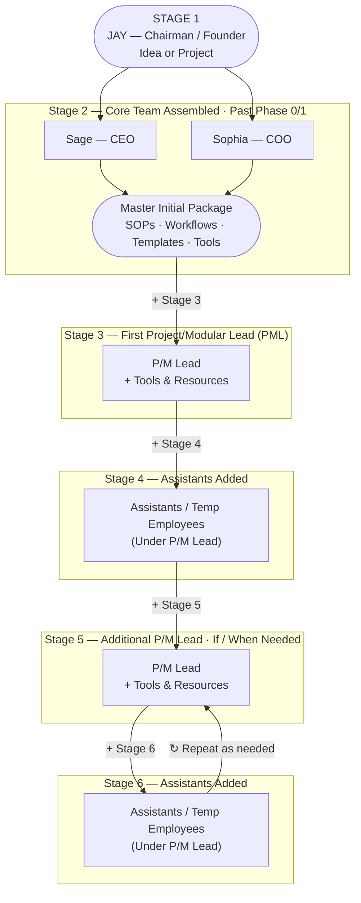

# Company Growth — Visual Workflow
*KISS method. Cumulative — each stage is Everything Above Plus (EAP). Scalable P/M Lead model — locked by Jay, Session 161.*

---

## Growth Stages — Scalable P/M Lead Model

---

## Notes

- **Cumulative by design** — every stage is Everything Above Plus (EAP). Nothing from a prior stage goes away.
- **Stage transitions** — arrows labeled `+ Stage N` show growth progression, not reporting structure.
- **P/M Lead (Project/Modular Lead)** — universal role label; specific agents or hires fill this slot per project.
- **Stages 5 + 6 loop** — the loopback arrow shows the cycle repeats as many times as scale demands; no upper limit.
- **Stage 5 is conditional** — add another P/M Lead only if / when scale demands it.
- **Living visual** — not yet inserted into the overall process. Design now, wire in later.
