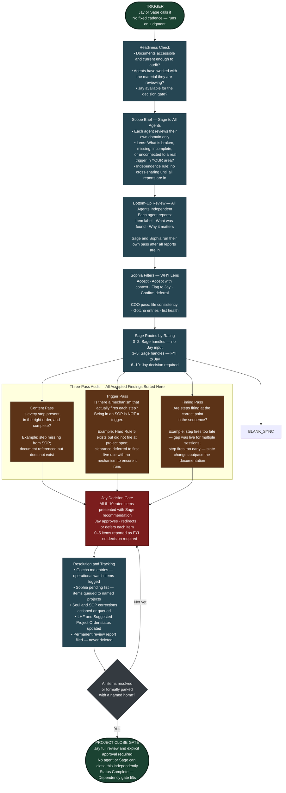

# Cross Talk / Fire Drill Workflow

**Paired SOP:** CrossTalk-FireDrill-SOP.md (SOPs folder)
**Jay's version — visual workflow replaces a written Jay SOP for this process**
**Version:** 0

---

**Version log:**

| Version | Date | Notes |
|---|---|---|
| v1.0 | (session unknown) | Initial build |
| v1.1 | 2026-05-24 | Version tracking added (no prior version recorded). HR13 sync — CrossTalk-FireDrill-SOP.md updated to v1.2 (administrative note removal only; no diagram changes required). Project 5 Phase 2 Final Alignment Sweep, Session 176. |

---

