```mermaid
%%{init: {'theme': 'dark', 'themeVariables': {'primaryColor': '#1E3A5F', 'primaryTextColor': '#ffffff', 'primaryBorderColor': '#4A9EFF', 'lineColor': '#7EB8D4', 'secondaryColor': '#1A2744', 'tertiaryColor': '#1A2744'}}}%%
flowchart TD
    classDef startEnd fill:#00695C,stroke:#004D40,color:#ffffff
    classDef process fill:#1565C0,stroke:#0D47A1,color:#ffffff
    classDef decision fill:#E65100,stroke:#BF360C,color:#ffffff

    START([Jay signals intent]):::startEnd
    TRIG{Compact or Session Close?}:::decision
    START --> TRIG

    TRIG -->|Compact Wrap-Up| CA_GATEMT
    TRIG -->|Session Close| CB_GATEMT

    subgraph COMPACT["  PART A — COMPACT WRAP-UP  "]
        CA_GATEMT{"MID-TASK GATE — before Step 0\nAny agent mid-task? (Sophia / P/M Lead in scope)\nDeclared in-progress task-state only — never observation"}:::decision
        CA_PARK["Resolve first: FINISH or explicit PARK\n(declared + captured to pending list / handoff / Session Summary)"]:::process
        CA0["Step 0: Pre-Compact Sweep\nFiles edited, paired counterparts, version bumps, pending items\nCross-reference + Backward Sweep\nStructural change this session? → Confirm all three governance docs current:\nF&F Reference · Visual TreeView · F&F Tree (Item 141)"]:::process
        CA_GATEMT -->|Mid-task| CA_PARK --> CA_GATEMT
        CA_GATEMT -->|All finished or parked| CA0
        CA_GATE{Jay confirms — continue to compact?}:::decision
        CA_MULTI{Active agents in this session?}:::decision
        CA_AGENTS["Each active agent tells Sage their piece\nIncludes agents dismissed earlier\nSophia captures — Sage reviews before push"]:::process
        CA1["Step 1: Sophia writes Session Summary — label CHECKPOINT\nUpdate Session Summary Index\nSage reviews before Step 7 push\nP/M Lead active: Lead writes sub-project summary in parallel"]:::process
        CA2[Step 2: project_context.md]:::process
        CA3[Step 3: MEMORY.md index files]:::process
        CA4[Step 4: ME - Jay.md]:::process
        CA5["Step 5: Lessons Files + Team Lessons Log\nAsk Sophia directly — record her answer by name"]:::process
        CA_SWEEP["Safety Net Catch Sweep\nAnything missed, broken, or gapped?\nAny decision not captured in a file?\nAny agent flag not in the record?\nResearch reports this session? → Route: project-specific → WorkTree · universal → ML Folder 12\nQueue gaps to Pending Changes before pushing"]:::process
        CA6["Step 6: Sophia — Pending Changes\nQueue changes + transfer check + catalog check\nTerminal items move to Completed Changes"]:::process
        CA7["Step 7: GitHub Push\nAll modified files + PPN files staged in same commit\nSage never reads PPN content — push only"]:::process
        CA8[Step 8: git status — must be CLEAN]:::process
        CA0 --> CA_GATE
        CA_GATE -->|Fix something first| CA0
        CA_GATE -->|Continue| CA_MULTI
        CA_MULTI -->|YES| CA_AGENTS --> CA1
        CA_MULTI -->|NO| CA1
        CA1 --> CA2 --> CA3 --> CA4 --> CA5 --> CA_SWEEP --> CA6 --> CA7 --> CA8
    end

    CA8 --> COMPACT_DONE([COMPACT NOW HAPPENS]):::startEnd

    subgraph CLOSE["  PART B — SESSION CLOSE  "]
        CB_GATEMT{"MID-TASK GATE — before Step 0\nAny agent mid-task? (Sophia / P/M Lead in scope)\nDeclared in-progress task-state only — never observation"}:::decision
        CB_PARK["Resolve first: FINISH or explicit PARK\n(declared + captured to pending list / handoff / Session Summary)"]:::process
        CB0["Step 0: Pre-Close Sweep\nSame as compact + check unaddressed discuss-later items\nCross-reference + Backward Sweep\nStructural change this session? → Confirm all three governance docs current:\nF&F Reference · Visual TreeView · F&F Tree (Item 141)"]:::process
        CB_GATEMT -->|Mid-task| CB_PARK --> CB_GATEMT
        CB_GATEMT -->|All finished or parked| CB0
        CB_GATE{Jay confirms — continue to close?}:::decision
        CB_MULTI{Active agents in this session?}:::decision
        CB_AGENTS["Each agent active this session tells Sage their piece\nIncludes agents dismissed earlier\nSophia captures — Sage reviews before push"]:::process
        CB1["Step 1: Sophia writes Session Summary — label SESSION END\nUpdate Session Summary Index\nSage reviews before Step 7 push\nP/M Lead active: Lead writes sub-project summary in parallel"]:::process
        CB2[Step 2: project_context.md]:::process
        CB3[Step 3: MEMORY.md index files]:::process
        CB4[Step 4: ME - Jay.md]:::process
        CB5["Step 5: Lessons Files + Team Lessons Log\nAsk Sophia directly — record her answer by name"]:::process
        CB_SWEEP["Safety Net Catch Sweep\nAnything missed, broken, or gapped?\nAny decision not captured in a file?\nAny agent flag not in the record?\nResearch reports this session? → Route: project-specific → WorkTree · universal → ML Folder 12\nQueue gaps to Pending Changes before pushing"]:::process
        CB6["Step 6: Sophia — Pending Changes\nTransfer check + catalog check\nTerminal items move to Completed Changes"]:::process
        CB7["Step 7: GitHub Push\nAll modified files + PPN files staged in same commit\nSage never reads PPN content — push only"]:::process
        CB8[Step 8: git status — must be CLEAN]:::process
        CB0 --> CB_GATE
        CB_GATE -->|Fix something first| CB0
        CB_GATE -->|Continue| CB_MULTI
        CB_MULTI -->|YES| CB_AGENTS --> CB1
        CB_MULTI -->|NO| CB1
        CB1 --> CB2 --> CB3 --> CB4 --> CB5 --> CB_SWEEP --> CB6 --> CB7 --> CB8
    end

    CB8 --> SESSION_DONE([SESSION DECLARED DONE]):::startEnd
```

=======================================================================
  MERMAID CODE
  Workflow: Session Closeout and Compact Actions
  Version: v1.3 — 2026-06-15
  How to use: Copy everything inside the code block below.
               Paste into mermaid.live. Export as PNG.

  v1.0 (session unknown) — initial build
  v1.1 — 2026-05-24: Safety net catch sweep added to both Part A and Part B
         (Item 76 — between Lessons step and Sophia Pending Changes step). PPN push
         noted in GitHub Push step, both parts (Part A: Item G5 mirror;
         Part B: matches Session-Close-SOP v3.7). P/M Lead model noted in Session
         Summary step, both parts (Item 103). Paired SOPs: Session-Close-SOP v3.7
         + Compact-Wrap-Up-SOP v3.9. Project 5 Phase 2 Final Alignment Sweep,
         Session 176. HR13 sync.
  v1.2 — 2026-05-31: Step 0 governance doc check added to both CA0 and CB0 (structural change this session → confirm F&F Reference, Visual TreeView, F&F Tree all current — Item 141). Research report routing question added to Safety Net Catch Sweep, both parts (project-specific → WorkTree; universal → ML Folder 12). SOP version refs updated: Session-Close-SOP v3.7 → v4.1; Compact-Wrap-Up-SOP v3.9 → v4.3. Project 5 final mermaid workflow update, Session 197.
  v1.3 — 2026-06-15: Mid-Task Gate added as the first decision node in both parts (Item 161 — Session SOP Suite, D4). Fires after the close/compact signal, before the Step 0 sweep node: "Any agent mid-task? (Sophia / P/M Lead in scope; declared in-progress task-state only, never observation)" → mid-task: resolve by FINISH or explicit PARK, loop back; all finished/parked: proceed to Step 0. Diagram confirmed current as of this edit. MUIP-env SOP refs: Session-Close-SOP v4.3; Compact-Wrap-Up-SOP v4.4 (MUIP local numbering). Session 254.
=======================================================================

