```mermaid
%%{init: {'theme': 'dark', 'themeVariables': {'primaryColor': '#1E3A5F', 'primaryTextColor': '#ffffff', 'primaryBorderColor': '#4A9EFF', 'lineColor': '#7EB8D4', 'secondaryColor': '#1A2744', 'tertiaryColor': '#1A2744'}}}%%
flowchart TD
    classDef startEnd fill:#00695C,stroke:#004D40,color:#ffffff
    classDef process fill:#1565C0,stroke:#0D47A1,color:#ffffff
    classDef decision fill:#E65100,stroke:#BF360C,color:#ffffff

    START([Session Opens]):::startEnd
    Q{Fresh Session or Post-Compact?}:::decision
    START --> Q

    subgraph PA["  PART A — FRESH SESSION START (Session-Start-SOP)  "]
        A_ID["Identity/loader auto-loads first\nglobal ~/.claude/CLAUDE.md + project CLAUDE.md\n(technical stack: plugins + hooks initialize)"]:::process
        A1[1. MEMORY.md index files]:::process
        A2[2. lessons_global-CP.md — C&P companion]:::process
        A3[3. Graphify query — current state\nphase, active work, recent decisions]:::process
        A3Q{graph.json present?}:::decision
        A3FB["Fallback — 5 files in order:\nME - Jay → Sage-project-soul →\nproject-file-index → project-navigation-map →\nmost recent Session Summary section"]:::process
        A4[4. Activity recall\nclaude-remember buffer + context-mode timeline]:::process
        A4Q{buffer present / timeline returns?}:::decision
        A4FB["Fallback — most recent\nSession Summary section only"]:::process
        A5[5. Just-in-time reads — gap-triggered only\nno pre-reading; query first, read narrowly]:::process
        A6["6. Activate Sophia (COO) + P/M Lead if active\nopening brief + Gotcha.md pulse check"]:::process
        APBM{PBM-eligible + track undeclared?}:::decision
        AASK["Sage asks which track first"]:::process
        ACONF["Confirm phase — proceed or wait for direction"]:::process

        A_ID --> A1 --> A2 --> A3 --> A3Q
        A3Q -->|YES| A4
        A3Q -->|NO| A3FB --> A4
        A4 --> A4Q
        A4Q -->|YES| A5
        A4Q -->|NO| A4FB --> A5
        A5 --> A6 --> APBM
        APBM -->|YES| AASK --> ACONF
        APBM -->|NO| ACONF
    end

    subgraph PB["  PART B — POST-COMPACT RETURN (Post-Compact-Return-SOP)  "]
        B_SCOPE{Post-compact or fresh session?}:::decision
        B_FRESH["Fresh session → use Part A instead"]:::process
        B_ID["Identity/loader PERSIST across compact\nglobal + project CLAUDE.md auto-reload\nworking state does NOT persist"]:::process
        B1["Read most recent CP section in Session Summary\nthe ONE mandatory read — holds full state"]:::process
        B2[Check Files Modified field — the in-flight map]:::process
        B3{{"Do NOT re-run the full session-start sequence"}}:::decision
        B4{Oriented? what / decisions / next / parked}:::decision
        B4JIT["Just-in-time read of the specific file"]:::process
        B5["Re-activate embedded agents\nSophia / P/M Lead — they do NOT survive a compact"]:::process
        B6["Resume in-flight / parked task\n(parked at compact via mid-task gate)\njust-in-time reads only"]:::process

        B_SCOPE -->|Fresh| B_FRESH
        B_SCOPE -->|Post-compact| B_ID --> B1 --> B2 --> B3 --> B4
        B4 -->|Gap| B4JIT --> B5
        B4 -->|Clear| B5
        B5 --> B6
    end

    Q -->|Fresh Session| A_ID
    Q -->|Post-Compact| B_SCOPE
    ACONF --> DONE_A([Ready — Session Active]):::startEnd
    B6 --> DONE_B([Ready — Compact Resumed]):::startEnd
```

=======================================================================
  MERMAID CODE
  Workflow: Sage Fresh Session and Post-Compact
  Version: v2.0 — 2026-06-15
  Visualizes: Session-Start-SOP.md (Part A) + Post-Compact-Return-SOP.md (Part B)
              — the two procedures it represents. SOPs are the source of truth;
              this is the Jay's-version visual.
  How to use: Copy the code block below. Paste into mermaid.live.
               Click the PNG export button to save your image.

  v1.0 (session unknown) — initial build
  v1.1 — 2026-05-31: lessons_global-CP.md corrected; project lessons.md step added; TEST FILE label removed.
  v2.0 — 2026-06-15: Full redraw to match the Session SOP Suite (Item 161). Part A
         (Fresh Session Start) rebuilt to the query-first model — graphify query +
         activity recall + just-in-time reads — superseding the retired bulk-read
         sequence (8 named-file reads). Part B (Post-Compact Resume) rebuilt to the
         Post-Compact-Return-SOP model: one mandatory CP-section read, do-not-re-run,
         re-activate embedded agents, resume. Identity/loader auto-load shown in both
         parts; fallbacks shown as branches. Header now references both SOPs as the
         procedures visualized. Supersedes the stale bulk-read model. Session 254.
=======================================================================

