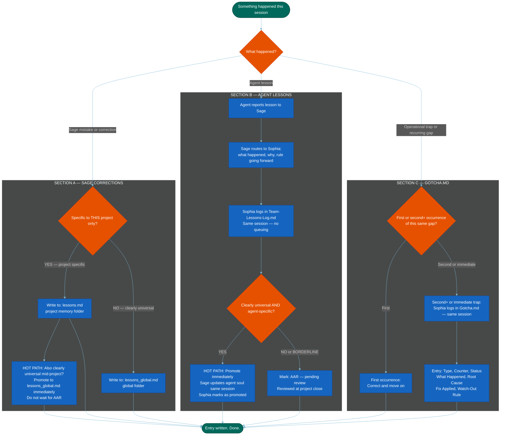

=======================================================================
  MERMAID CODE
  Workflow: Lessons and Gotcha Routing
  Version: v1.0 — 2026-05-31
  How to use: Copy everything inside the code block below.
               Paste into mermaid.live. Export as PNG.
=======================================================================

