```mermaid
%%{init: {'theme': 'dark', 'themeVariables': {'primaryColor': '#1E3A5F', 'primaryTextColor': '#ffffff', 'primaryBorderColor': '#4A9EFF', 'lineColor': '#7EB8D4', 'secondaryColor': '#1A2744', 'tertiaryColor': '#1A2744'}}}%%
flowchart TD
    classDef startEnd fill:#00695C,stroke:#004D40,color:#ffffff
    classDef process fill:#1565C0,stroke:#0D47A1,color:#ffffff
    classDef decision fill:#E65100,stroke:#BF360C,color:#ffffff

    REQ([Agent / Jay submits build need to Sage]):::startEnd
    GATE[Sage gate: CEO relevance check + ML-first check\nAlready in Master Library / Deployable Arsenal roll-up?]:::process
    START([Sage authorizes build\nBrief issued to Cosmo]):::startEnd
    REQ --> GATE --> START

    subgraph P1["  PART 1 — INTAKE & DESIGN  "]
        DEDUP["Step 1: Deduplication Check\nCosmo confirms with Lexi —\ndoes an equivalent already exist?"]:::process
        DEDUP_Q{Equivalent exists?}:::decision
        UPDATE["Update or version existing entry\nNo new build needed"]:::process
        SYNTH["Step 2: Synthesis Evaluation\n3 checks before committing:\n1. Can existing components be reused?\n2. Can two resources be combined?\n3. Is this the leanest path?"]:::process
        SYNTH_Q{Better path found?}:::decision
        FLAG["Flag alternative to Sage\nWait for direction"]:::process
        DEDUP --> DEDUP_Q
        DEDUP_Q -->|YES| UPDATE
        DEDUP_Q -->|NO| SYNTH
        SYNTH --> SYNTH_Q
        SYNTH_Q -->|YES| FLAG
        FLAG --> SAGE_DIR[Sage gives direction\nCosmo proceeds or pivots]:::process
    end

    UPDATE --> DONE
    SAGE_DIR --> EXT_Q
    SYNTH_Q -->|NO — proceed| EXT_Q

    subgraph P2["  PART 2 — BUILD  "]
        EXT_Q{External resources needed?}:::decision
        SOREN["Confirm Soren clearance\nBefore touching any external resource"]:::process
        CLEARED_Q{Cleared?}:::decision
        BLOCKED([Resource blocked\nSage handles]):::startEnd
        BUILD["Step 3: Build\nSkill / Hook / CLI / MCP / Plugin"]:::process
        VERIFY["Step 4: Verify and Document\nTest against use case\nDraft registry entry"]:::process
        EXT_Q -->|YES| SOREN
        EXT_Q -->|NO| BUILD
        SOREN --> CLEARED_Q
        CLEARED_Q -->|NOT CLEARED| BLOCKED
        CLEARED_Q -->|CLEARED| BUILD
        BUILD --> VERIFY
    end

    subgraph P3["  PART 3 — HANDOFF & COMPLETION  "]
        DELIVER["Step 5: Deliver to Sage\nBuild + what it does + trigger method\n+ library section + dependencies"]:::process
        APPROVE_Q{Sage approves?}:::decision
        LEXI["Lexi catalogs in Master Library"]:::process
        SOPHIA_LOG["Sophia logs to:\n→ Deployable Arsenal roll-up (ML Quick Reference)\n→ Project Resources Log"]:::process
        SAGE_REVIEW["Sage reviews roll-up entry\nConfirms logging complete"]:::process
        VERIFY --> DELIVER
        DELIVER --> APPROVE_Q
        APPROVE_Q -->|REVISE| BUILD
        APPROVE_Q -->|APPROVED| LEXI
        LEXI --> SOPHIA_LOG
        SOPHIA_LOG --> SAGE_REVIEW
    end

    SAGE_REVIEW --> DONE([Build complete. Pipeline closed.]):::startEnd
```

=======================================================================
  MERMAID CODE
  Workflow: Cosmo Build Pipeline
  Version: v1.3 — 2026-06-21 (P8 Item 189: log destination re-pointed Approved Resources Registry → Deployable Arsenal roll-up (ML Quick Reference) at GATE/SOPHIA_LOG/SAGE_REVIEW nodes — registry folded + retired; faithful swap. Paired with Cosmo-SOP v3.5/SOP-Jay v2.4. Session 267.) v1.2 — 2026-06-19 (Front-stage added: agent→Sage relevance + ML-first gate, upstream of authorize — Session 264. v1.1: Approved Resources Registry rename.)
  How to use: Copy everything inside the code block below.
               Paste into mermaid.live. Export as PNG.
  Note: Upstream — if a Resource Report from Rose's research report
        pipeline (Rose-Researcher-Mermaid.md) triggers this
        pipeline, Soren has already cleared the external resource and
        Lexi has already filed it. Cosmo builds from cleared materials.
=======================================================================

