```mermaid
%%{init: {'theme': 'dark', 'themeVariables': {'primaryColor': '#1E3A5F', 'primaryTextColor': '#ffffff', 'primaryBorderColor': '#4A9EFF', 'lineColor': '#7EB8D4', 'secondaryColor': '#1A2744', 'tertiaryColor': '#1A2744'}}}%%
flowchart TD
    classDef startEnd fill:#00695C,stroke:#004D40,color:#ffffff
    classDef process fill:#1565C0,stroke:#0D47A1,color:#ffffff
    classDef decision fill:#E65100,stroke:#BF360C,color:#ffffff
    classDef formatKey fill:#4A235A,stroke:#7D3C98,color:#ffffff
    classDef statusGreen  fill:#1B5E20,stroke:#388E3C,color:#ffffff
    classDef statusYellow fill:#F9A825,stroke:#F57F17,color:#000000
    classDef statusOrange fill:#E65100,stroke:#BF360C,color:#ffffff
    classDef statusRed    fill:#B71C1C,stroke:#7F0000,color:#ffffff
    classDef statusGray   fill:#424242,stroke:#212121,color:#ffffff

    START([Academic Project Activated]):::startEnd

    subgraph SETUP["  SETUP — Student/Operator Owns Steps 1–4  "]
        S1["1. Create unit folder\nwhen each unit begins"]:::process
        S2["2. Create support docs folder\ninside the unit folder"]:::process
        S3["3. Place the plan in support docs folder\nwhen you have it — may arrive\nbefore or after COURSESTART"]:::process
        S4["4. Inform Sage + Sophia + Feynman"]:::process
        S1 --> S2 --> S3 --> S4
    end

    START --> S1

    subgraph COURSESTART["  COURSE START — Team Activates on Step 5  "]
        A1["Feynman reads full plan\nMaps all due dates, deliverables,\nand submission formats"]:::process
        A2["Feynman backward-plans from every deadline\nAssigns prep milestones to prior weeks\n3 wks: Midterms · Finals · Major deliverables\n2 wks: Tests · Lesser assignments\n1 wk: Quizzes · Homework"]:::process
        A3["Feynman writes all weekly notes\nFlags urgency weeks with special names"]:::process
        ASAGE["Sage reviews Feynman's unit map\nApproves before Sophia executes"]:::process
        A4["Sophia creates all week folders\nApplies naming convention\nPlaces weekly notes"]:::process
        AMERMAID["Feynman generates Structure Visual Map\nSage reviews · Sophia places in unit folder root"]:::process
        ACOLOR["All deliverables initialized to Green status\nFirst-seen date = COURSESTART date\nCanonical classDef block included in map file"]:::process
        A1 --> A2 --> A3 --> ASAGE --> A4 --> AMERMAID --> ACOLOR
    end

    S4 --> A1

    subgraph WEEKLY["  WEEKLY CYCLE — Repeats Every Week  "]
        W1["Student/operator works current week\nReviews current week notes"]:::process
        WGATE{"Session opens — any unit updates?\nNew info · assignment changes · surprises"}:::decision
        WCOLOR_ONLY["Feynman: Color-only pass\nRecalculates % for all deliverables\nUpdates map if thresholds crossed\nWeekly notes unchanged"]:::process
        W2["Feynman: Full review pass\nUpdates future weekly notes\nbased on new info"]:::process
        WCOLOR["Feynman recalculates time-remaining % for all deliverables\nUpdates node color classes in Structure Map\nDelivers rebuilt map file to Sage"]:::process
        WSAGE["Sage reviews updated Structure Map\nApproves before Sophia executes"]:::process
        W3["Sophia stages next week folder · adds needed files\nReplaces Structure Map file in unit folder root"]:::process
        WD{"Last week of unit?"}:::decision
        W1 --> WGATE
        WGATE -->|"No — nothing new"| WCOLOR_ONLY
        WGATE -->|"Yes — updates to share"| W2
        WCOLOR_ONLY --> WSAGE
        W2 --> WCOLOR --> WSAGE
        WSAGE --> W3 --> WD
    end

    AMERMAID --> W1
    WD -->|"No — advance to next week"| W1
    WD -->|"Yes"| C1

    C1["Deliverable submitted\nUnit mini-project closes"]:::process
    CD{"More units?"}:::decision
    C1 --> CD
    CD -->|"Yes — next unit"| S1
    CD -->|"No"| DONE(["All phases complete\nAcademic project closes"]):::startEnd

    subgraph FORMATS["  STRUCTURE MAP — FORMAT GUIDE  "]
        direction LR
        FMT1["FORMAT 1 — C&P\nLight week · Single line per entry\n \nEx: Week 3\nCh. 5–6 reading | Discussion post due"]:::formatKey
        FMT2["FORMAT 2 — BULLETS\nBusy week · Multiple items\n \nEx: Week 7 (Midterm this week)\n• Midterm — Wed\n• Essay draft due — Fri\n• Start Project #2"]:::formatKey
        FMT3["FORMAT 3 — COMBO\nHeavy week · Headline + bullets\n \nEx: Week 10 (Final this week)\nHeavy week — 3 items closing\n• Final Exam — Mon\n• Research Paper — Wed\n• Portfolio — Fri"]:::formatKey
    end
```

=======================================================================
  MERMAID CODE
  Workflow: [Long-Term Academic Project] Workflow
  Version: v1.2 — 2026-06-23 (MUIP genericization — parameterized into a reusable
           academic-project template; bound UMassD/course version preserved elsewhere)
  How to use: Copy the code block below. Paste into mermaid.live.
               Click the PNG export button to save your image.
               Placeholders: [academic project] · [project/phase] · [plan] ·
               [course-code] · [unit] · [deliverable submitted] · [all phases complete]
=======================================================================

