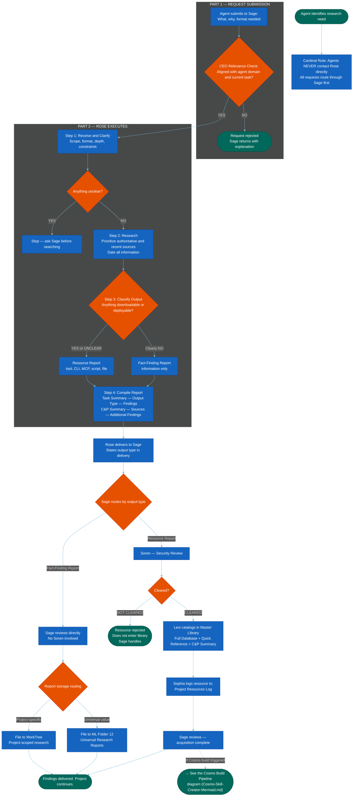

=======================================================================
  MERMAID CODE
  Workflow: Research Report Request Pipeline
  Version: v1.1 — 2026-05-31 (CQC-A: fact-finding report storage routing added at point of delivery)
  How to use: Copy everything inside the code block below.
               Paste into mermaid.live. Export as PNG.
=======================================================================

